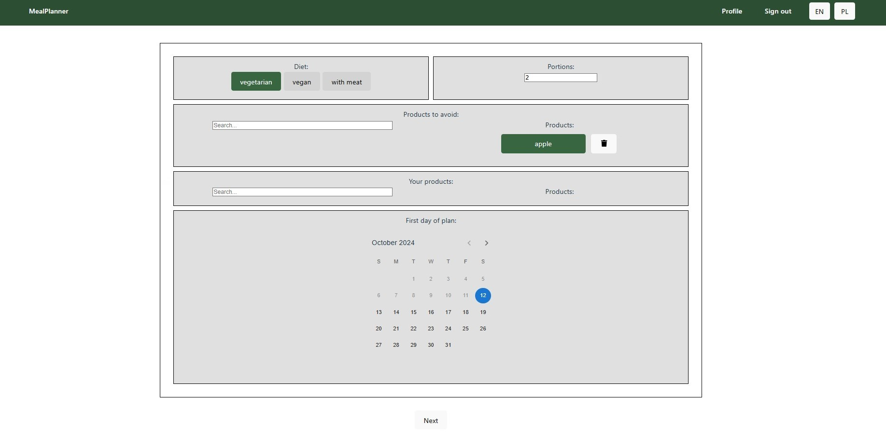
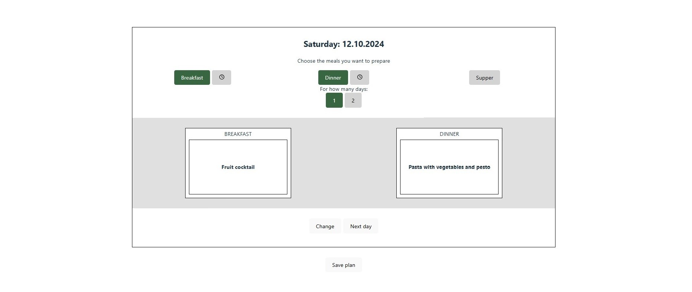

# Meal Planner Web App

## Screenshots

&nbsp;

## Functionalities

**Meal plan generator.**\
Creating a personalised list of recipes for a specified number of days.\
The main rule of the program is to calculate the leftovers after each day and prioritize using them in the following days of the plan.
The calculations are based on information about product packing sizes stored in the database.

Creating options:
- Choose your preferences (diet, number of portions, products to avoid, already owned products). The first three options are saved and autocompleted in the form for generating future plans.
- Set and edit the plan’s dates.
- Adjust meal types for each day. Additionally, set the cooking time and choose the option to prepare meals for 2 days (only available for dinners).
-  If necessary, change the suggested recipes.

**Authentication.**\
Login and registration secured by JWT tokens (access and refresh).

&nbsp;

## Technologies
 &nbsp;
 &nbsp;
 &nbsp;
 &nbsp;
 &nbsp;
 &nbsp;

 &nbsp;
 &nbsp;
 &nbsp;
 &nbsp;

&nbsp;

## Status
The project is still in progress. I plan to focus more on testing and, later, add a grocery list feature,
allow user profile editing (changing email and password), and improve the interface to make it more user-friendly.

&nbsp;

##
Link to backend code: [meal-planner-backend](https://github.com/al-Bala/MealPlanner-v2-backend)
